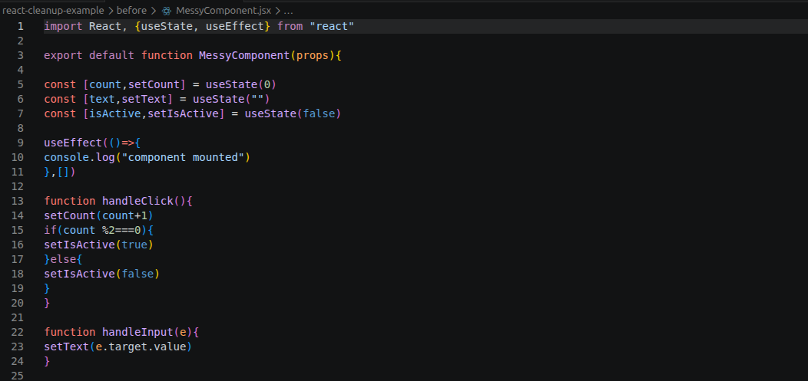
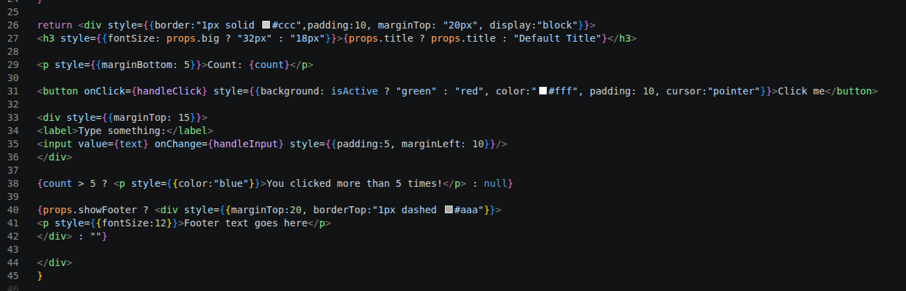
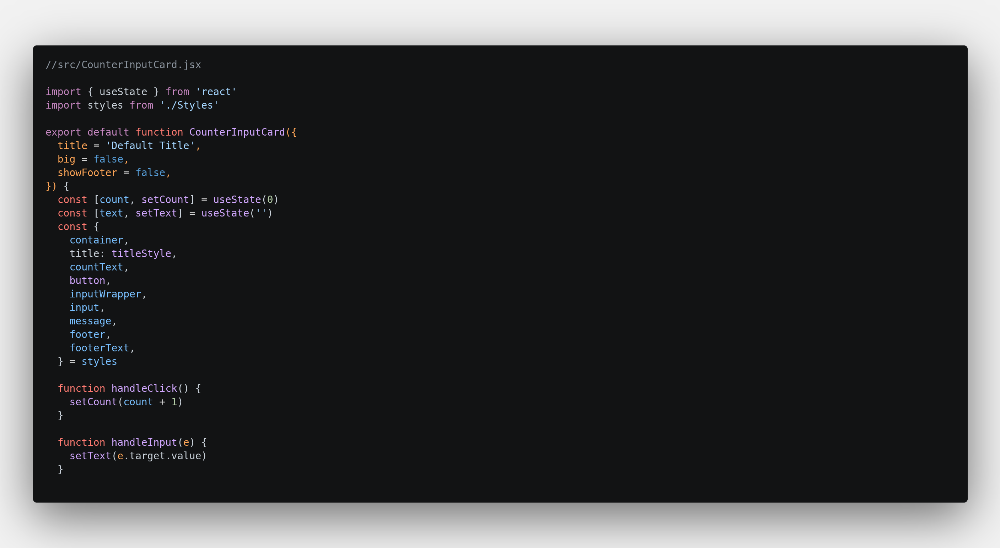
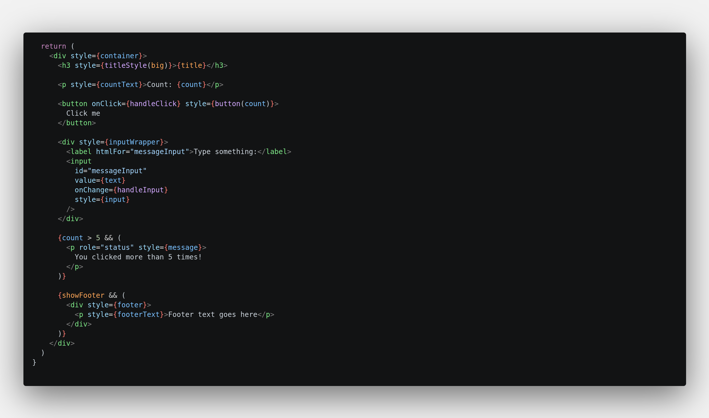
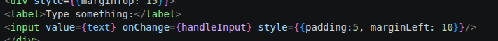
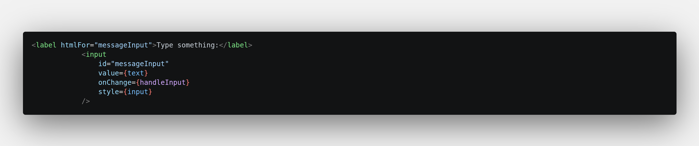

# React Cleanup Example — Before/After Refactor

This project demonstrates my ability to take a messy, hard‑to‑maintain React component and refactor it into clean, readable, accessible, and reusable code. It represents the type of UI cleanup, component fixes, and frontend improvements I deliver for clients.

---

## 🔧 What This Example Shows

- Refactoring messy React code into clean, maintainable components  
- Improving readability, structure, and naming  
- Removing unnecessary state and simplifying logic  
- Replacing inline styles with reusable styling  
- Improving accessibility (labels, semantics, keyboard use)  
- Cleaning up conditional rendering  
- Making UI behaviour more predictable and consistent  

---

## 📁 Project Structure

react-cleanup-example/
|── before/
│     └── MessyComponent.jsx   ← original messy version (before)
├── src/
│     ├── CounterInputCard.jsx   ← cleaned version (after)
│     └── App.jsx
└── README.md

The **before** and **after** versions are kept separate so you can clearly see the improvements.

---

## ▶️ Running the Project

Install dependencies:

Start the dev server:
Install dependencies:
- npm install
Start the dev server:
- npm run dev

Then open the local URL shown in the terminal to view the component in the browser.

## 🛠 Tech Stack

- React  
- Vite  
- JavaScript (ES6+)  
- JSX  

---

## 📝 Before → After Summary

### Before (MessyComponent.jsx)
- Inline styles everywhere  
- Unnecessary state (`isActive` derived from `count`)  
- Inconsistent formatting  
- Mixed logic and presentation  
- Hard‑coded colours  
- Accessibility issues  
- Repeated conditional patterns  
- Props used without defaults or clarity  

### After (CounterInputCard.jsx)
- Extracted, reusable styling  
- Simplified state and logic  
- Clear naming and structure  
- Improved accessibility  
- Predictable behaviour  
- Cleaner JSX  
- More maintainable and scalable  

---

## 📸 Suggested Screenshots for Portfolio

- **Before screenshot:** messy component code 

- **Before screenshot:** messy render code

- **After screenshot:** cleaned component code

- **After screenshot:** cleaned render code

- **Accessibility improvements:** label/input, focus states
**Before:**  
- Label not associated with input  
- No `id` on the input  
- Screen readers could not understand the form  
- Dynamic message not announced 

**After:**  
- Added `id` + `htmlFor` to correctly link label and input  
- Added `role="status"` so screen readers announce dynamic updates  
- Improved keyboard and screen‑reader accessibility

These visuals help clients instantly understand the value you provide.

---

## 💡 Why This Project Matters

Most real‑world frontend work isn’t building huge apps — it’s fixing:

- spacing  
- layout  
- accessibility  
- messy components  
- inconsistent styling  
- confusing logic  

This example shows exactly the kind of high‑impact, fast‑turnaround improvements I specialise in.

---

## 📬 Want Something Similar?

If you need help cleaning up your React components, improving UI consistency, or fixing layout and accessibility issues, I can help.  
